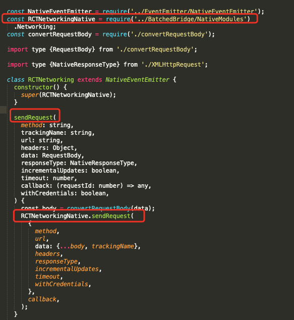
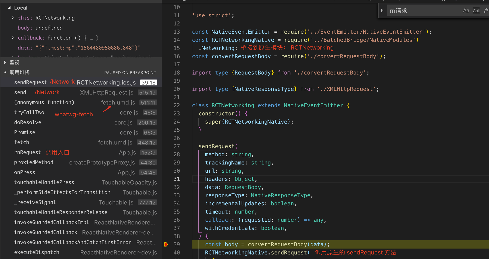

## 一、背景

最近开始项目需要具备动态更新能力，在大家商讨之后决定首先使用 React Native 。RN 不仅具备动态更新能力，还具有跨平台和快速调试的能力，在UI界面的开始上显著的提高了效率。

但是 RN 本质是 JS 转 原生代码（OC），在性能上存在一定的损耗，无法完全达到原生的体验和效果。所以，本次分析的目的找出调用原生请求和自带 fetch 请求的差别，为我们的 RN技术选型提供参考。

## 二、耗时对比

环境搭建
为了测试耗时，我专门建立了一个 RN 项目，主要功能是递归的发送原生请求和 fetch 请求，可以修改递归次数，然后统计次数、总耗时、每次请求耗时。项目链接
结果预览

  

                
  图一                                                 
  
   

 
   图二
图片说明：
“清除所有”，是指清除界面下部分的测试数据，点击生效
“修改次数”，是指修改连续请求的总次数，点击之后将次数修改为 改按钮前面的输入框中指定的值。
“rn请求”，是指开始发送 fetch 请求
“调用原生请求”，是指开始发送 原生请求
"rn请求结果"，只是请求结果的一个标题
“调用原生请求结果”，只是请求结果的一个标题
“c→1, t→5927, d→ 5927”, 类似这样数据都是测试数据，其中，"c" 代表次数，"t"代表总耗时（单位 ms），"d"代表本次请求耗时（单位 ms）

操作说明
首先设置测试请求次数为 30 ，然后点击 “rn请求” 按钮，开始发送请求。当观察到左边次数为30的时候，开始点击 “调用原生请求”按钮，然后观察。当右边次数为30的时候，测试完成。
其他说明
本次测试的请求为用钱宝首页信息，地址为 http://192.168.6.190:19010/api/v5/index
结果分析
30次请求的总耗时：RN 为 64985ms, 原生为 3314ms , 二者相差近20左右
最小耗时： RN 为 684ms， 原生为74ms
最长耗时：RN 为 10831ms， 原生为 162
从数据中发现，由于网络情况不稳定，出现一些请求耗时明显过长，所以在剔除一些不合理数据之后可以总结出：RN 单次耗时约为 800ms，原生单次请求耗时约为 90ms，所以 RN 请求耗时大约是原生请求的 8 倍。
结果说明
本次测试样本数据并不多，测试环境也不稳定，所以测试数据只能作为参考。对测试结果只能作为参考。

## 三、源码分析

 

 
图三

上图说明了 RN 的网络库底层主要是使用了 whatwg-fetch 库。

而在 whatwg-fetch 内部 fetch 函数内有如下的代码：

function fetch(input, init) {
    return new Promise(function(resolve, reject) {
    ...
    var xhr = new XMLHttpRequest();
    ...
     xhr.send(typeof request._bodyInit === 'undefined' ? null : request._bodyInit);
    })
  }
就这表明 whatwg-fetch  就是对 XMLHttpRequest 的封装，而 XMLHttpRequest  就是 我们所熟知的 ajax 。

而这里的 XMLHttpRequest 使用的是一个全局对象，由 Facebook 封装，路径在 react-native/Libraries/Network/XMLHttpRequest.js ，在这个文件内部引用了 RCTNetworking ，用来发送请求。RCTNetworking 有iOS版本和 Android 版本。iOS版本如下：

 

 
                    图四

图四中，首先引用原生模块 RCTNetworkingNative ，然后在对外暴露的方法内部最终调用了原生方法  RCTNetworkingNative.sendRequest() 来发送请求。而 RCTNetworkingNative 正是由原生代码桥接而来。具体可以看RCTNetworking.mm。

 

 
                                                                                                                                                        图五

图五为函数调用栈，调用入口从左边的  rnRequest 开始，一直到右边调用原生的 sendRequest 方法。

## 四、总结

本文耗时和源码方面分析了 RN fetchAPI 发送请求和调用原生请求的差异，总体结论是在耗时上调用原生请求更少，直接调用原生请求的耗时只有 RN 请求的十分之一左右时间。

（说明：本人为 RN新手，对前端了解页很少，分析也不够全面，分析的结论也可能不是十分准确，仅供参考）

